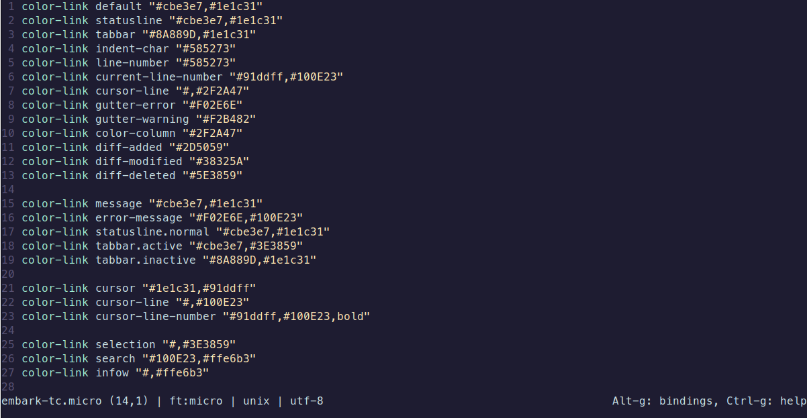

# Micro

A [Micro](https://github.com/zyedidia/micro) theme for the ambitious.



## How to use

1. Download `embark-tc.micro` and place it into `~/.config/micro/colorschemes`

```bash
mkdir -p ~/.config/micro/colorschemes
cd ~/.config/micro/colorschemes
curl -O https://raw.githubusercontent.com/embark-theme/micro/refs/heads/main/embark-tc.micro
```

2. Ensure you have [True Color](https://github.com/zyedidia/micro/blob/master/runtime/help/colors.md) enabled for Micro:
```bash
export MICRO_TRUECOLOR=1
```

3. Run `micro`, press `CTRL+E` and type `set colorscheme embark-tc`